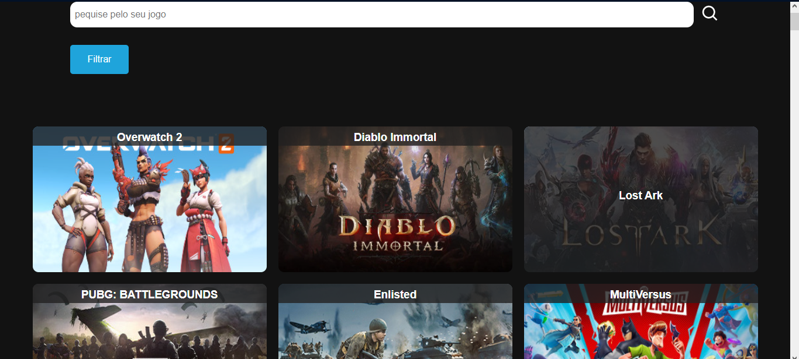

# super jogos

## o que é
super jogos é um projeto de processo seletivo para uma vaga de estágio front-end.

## tecnologias 
- React
- TypeScript
- vite
- Docker

## imagens do projeto

## Hospedagem
por ora, o projeto vai ficar hospedado na azure. segue o link de acesso.

Link: http://20.80.241.39:80

## Docker hub
você também pode encontrar o projeto no meu docker-hub

Link: https://hub.docker.com/repository/docker/manricklazaro/super_jogos/general

se quiser baixar a imagem digite no terminal:
> $ docker pull manricklazaro/super_jogos
